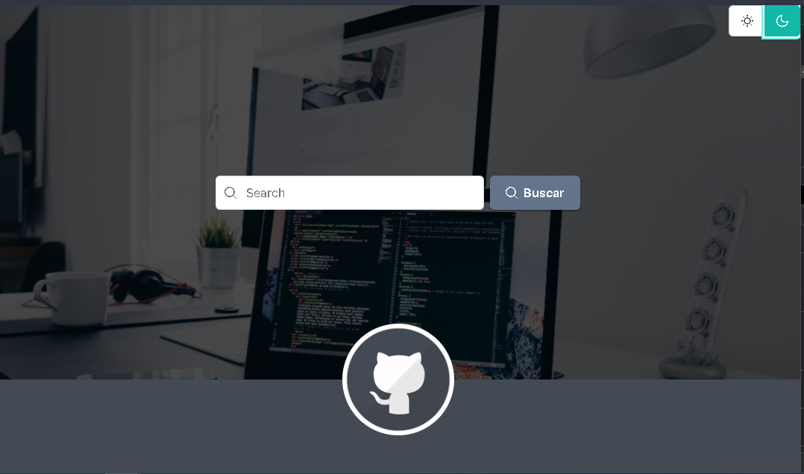
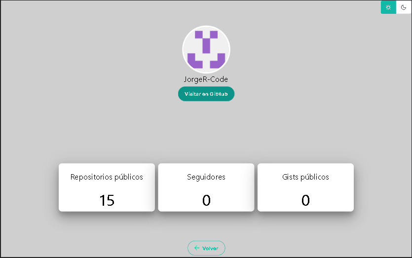

## Table of contents

- [Overview](#overview)
  - [The challenge](#the-challenge)
  - [Figma](#figma)
  - [Solution](#solution)
  - [Links](#links)
- [My process](#my-process)
  - [Built with](#built-with)
  - [Process](#process)
  - [Colors and fonts](#useful-resources)


## Overview

### The challenge
GitHub user search engine.

Users should be able to:

- Search by username.
- View relevant user information.


Estimated development time: 5 hrs.
Real development time: 12 hrs.

Estimated build time: 30 seg.
Real time of build: 45 seg.

### Figma


### Solution




### Links

- Solution URL: [GitHub user search engine](https://search-git-hub.herokuapp.com/)

## My process

### Built with

- Semantic HTML5 markup
- SCSS custom properties
- PimeNG
- Desktop-first workflow
- [Angular](https://angular.io/) - Angular framework


### Process
#### Get started

First we are going to create a new angular application.

```shell
ng new buscadorGH
```
To work with the styles and the dynamic elements we use PrimeNg, so we will do the installation.

```shell
npm install primeng primeicons
```
The configuration process of PrimeNg can be found on its official page at the following link:
[PrimeNG](https://primefaces.org/primeng/showcase/#/setup)

Now, within the application we will create a new module with the following command:

```shell
ng g m primeNg
```

The function of this module is to import and export the PrimeNG own modules that are required, it is a way to better organize the code.
This will look something like this:

```js
import { NgModule } from '@angular/core';
import { CommonModule } from '@angular/common';

import {SelectButtonModule} from 'primeng/selectbutton';
import {InputTextModule} from 'primeng/inputtext';
import {ButtonModule} from 'primeng/button';
import {ProgressSpinnerModule} from 'primeng/progressspinner';
import {CardModule} from 'primeng/card';


@NgModule({
  imports: [
    CommonModule,
  ],
  exports:[
    SelectButtonModule,
    InputTextModule,
    ButtonModule,
    ProgressSpinnerModule,
    CardModule
  ]
})
export class PrimengModule { }

```
#### Routing module

In order to go from the search page to the profile page we will need to create a component that allows us to change without refreshing the entire main page. For this we create a new module in the root folder as follows:

```shell
ng g m appRouting

```
With wich we declare the following:

```js
import { NgModule } from "@angular/core";
import { RouterModule, Routes } from "@angular/router";
import { ProfileComponent } from "./profile/profile/profile.component";
import { SearchComponent } from "./search/search/search.component";


const routes: Routes = [
  {
    path: '',
    component: SearchComponent,
    pathMatch: 'full'
  },
  {
    path: 'profile/:name',
    component: ProfileComponent
  },
  {
    path: '**',
    redirectTo: ''
  }
]

@NgModule({
  imports: [
    RouterModule.forRoot(routes)
  ],
  exports: [
    RouterModule
  ]
})
export class AppRoutingModule{}

```
Within which a constant "routes" is created in which the routes that our page may have and the components that will be shown in each of them are defined. Those components are described below:

#### Search Component

We will have two components, the first will be the search component, in this it will be the component that will receive the search parameters.To do this from console we execute the following command:

```shell
ng g c search/search

```
it should be noted that this folder will have its own module to import the modules that are required, as well as to export the component itself. Inside the search.component.html wi will have the following html structure:

```html
<div class="container1" [ngClass]="{'containerB': obscuro, 'container1': !obscuro}"
>
  <div class="container2">
    <div class="imgBack">
      <app-top (theme)="changeTheme($event)"></app-top>
      <div class="flexx flex flex-wrap">
        <span class="p-input-icon-left min-w-12 md:w-4 lg:w-4">
          <i class="pi pi-search"></i>
          <input  #usuario type="text" pInputText placeholder="Search" class="w-12 min-w-min" [(ngModel)]="value3" (keydown.enter)="valorBusqueda(usuario.value)"/>
        </span>

      <p-button type="button" icon="pi pi-search" label="Buscar" styleClass="p-button-raised p-button-secondary ml-2" (onClick)="valorBusqueda(usuario.value)"></p-button>
      </div>
      <div class="flex justify-content-center align-items-end">
        <div class="githubCircle">
          
        </div>
      </div>
    </div>
  </div>
</div>

```
Note that the <app-top> tag is a component to be able to change the color of theme.
Inside search.component.ts we will have the following function with which we can navigate to the "profile" component, passing it search parameter.

```js
  valorBusqueda(usuario: string){

    if(usuario){
      const valueUser = usuario;
      this._route.navigate(['/profile', valueUser]);
    }else{
      return
    }

  }
```

#### Profile component

Within our profile component we will have the following:

```js
export class ProfileComponent implements OnInit {

  user!: UserGH;
  obscuro: boolean = false;

  constructor(private activateRoute: ActivatedRoute, private searchUser: ServiceGHService, private _route: Router) { }

  ngOnInit(): void {

    this.activateRoute.params
    .pipe(
      switchMap(({name}) =>this.searchUser.searchUser(name))
    )
    .subscribe(user => this.user = user);
  }

  visitar(){
    window.location.href = this.user.html_url;
  }

  changeTheme(valor: any){
    this.obscuro = valor.option.value;
  }

  volver(){
    this._route.navigateByUrl('./');
  }
}
```
Within our ngOnInit we suscribe to our service with which the request will be made, the service is described below.

#### REST API - GitHub

The oficial API documentation can be found at the following link:
[REST API](https://docs.github.com/es/rest/reference/users)

To start a file called service-gh.service.ts is created, inside this file we created a private property which will be the first part of our URL to be able to make the request.

```js
private apiURL: String = 'https://api.github.com/users';
```
Inside the constructor we inject the HttpClient service to be able to make HTTP requests.

```js
constructor(private http: HttpClient) { }
```
And finally a function is created which receives the search parameter to complete the url and return the response.

```js
  searchUser (termino: string):Observable<UserGH>{

    const url = `${this.apiURL}/${termino}`;
    return this.http.get<UserGH>(url);

  }
```

Our service is as follows:

```js
import { HttpClient } from '@angular/common/http';
import { Injectable } from '@angular/core';
import { Observable } from 'rxjs';
import { UserGH } from '../interfaces/user.interface';

@Injectable({
  providedIn: 'root'
})
export class ServiceGHService {

  private apiURL: String = 'https://api.github.com/users';
  constructor(private http: HttpClient) { }

  searchUser (termino: string):Observable<UserGH>{

    const url = `${this.apiURL}/${termino}`;
    return this.http.get<UserGH>(url);

  }

}

```
### Built with

Search page:
- primary color: rgba(135, 135, 135, 0.8);
- second color: rgba(0, 0, 0, 0.7);

Profile page:
- primary color: rgb(207, 207, 207);
- second color: rgb(49, 49, 49);

Font:
- font-family: -apple-system, BlinkMacSystemFont, 'Segoe UI', Roboto, Oxygen, Ubuntu, Cantarell, 'Open Sans', 'Helvetica Neue', sans-serif;

